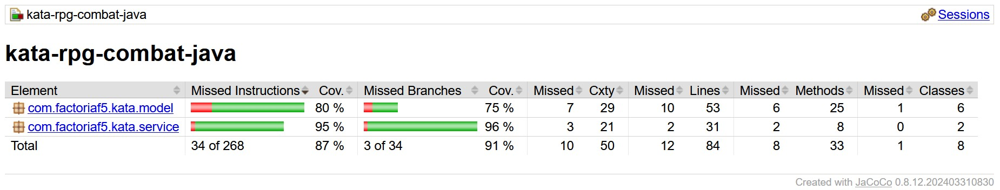

# Kata RPG Combat

## Introducción

Creación de programa que utiliza diferentes mecánicas de videojuegos RPG, divididas en iteraciones que implementar y refactorizar.
### 1. **Personajes:**
  - Tendrán Health (iniciada en 1000).  
  - Tendrán Level (Iniciado en 1).  
  - Estarán Alive o Dead (True/False, iniciado en Alive).  
### 2. **Ataque:**  
  - Un personaje podrá dañar a otro, Damage es substraido de Health.  
  - Cuando Damage supera Health, esta pasa a ser 0 y el personaje a estar Dead.  
  - Un personaje no puede dañarse a sí mismo.  
  - Al atacar:  
    * Si el Target tiene 5 o más Levels que el atacante, el Damage se reduce en un 50%  
    * Si tiene 5 o menos, aumenta en un 50%.  
  - Los personajes tendrán un rango máximo de ataque, Target tendrá que estar dentro de ese rango para hacer Damage.  
  - Melee fighters tienen un Range de 2 metros, Ranged fighters tienen uno de 20 metros.  
### 3. **Curación:**
  - Un personaje puede curarse a sí mismo.  
  - No puede curarse a personajes Dead.  
  - La curación no puede subir Health por encima de 1000.  
### 4. **Facciones:**
  - Los personajes podrán pertenecer a una o más Factions, no pertenecen a ninguna al ser creados.
  - Pueden unirse a o abandonar una o más Factions.  
  - Los personajes que pertenecen a la misma Faction son Allies:
    * Los Allies no pueden atacarse entre ellos.
    * Los Allies pueden curarse entre ellos.  
### 5. **Objetos:**
  - Los personajes pueden atacar a cosas que no sean personajes (Props).
    * Cualquier cosa con Health puede ser objetivo.
    * Estas no pueden ser curadas   ni hacer Damage.  
    * No pertenecen a Factions.
    * Cuando su Health se reduce a 0, son destruidas.
   
---

## Requisitos y dependencias

- Java 21
- Maven
- JUnit y Hamcrest

---

## Instalación

- Clonar repositorio
- ```mvn compile```

---

## Testing

- ```mvn test```
- Abrir Target/Site/Jacoco/Index.html (*Open with Live Server*)

